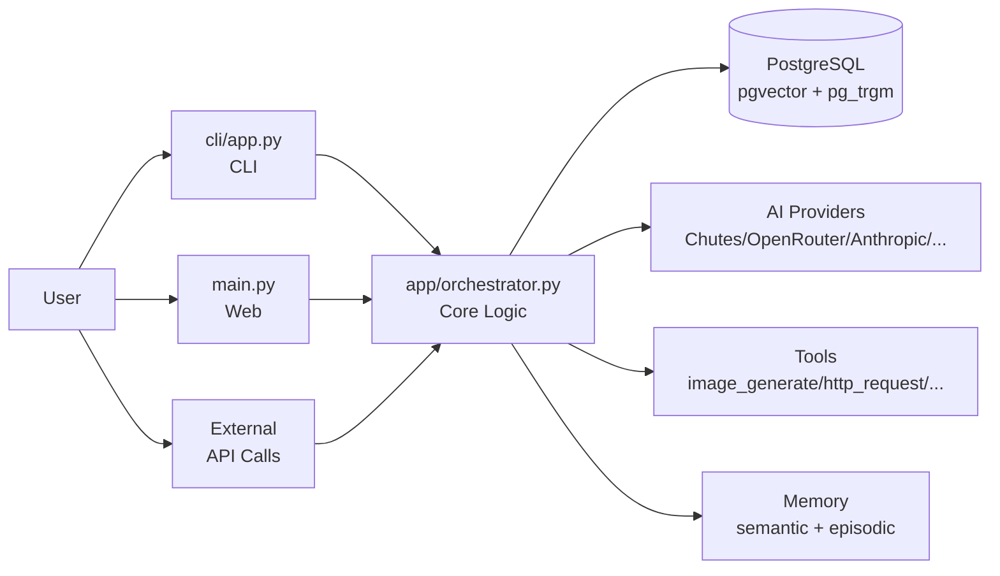
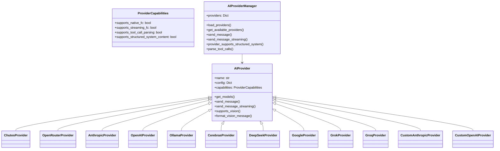
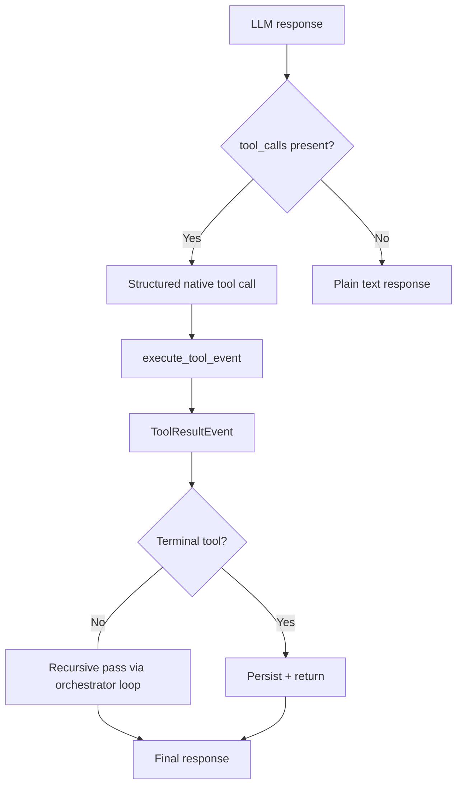
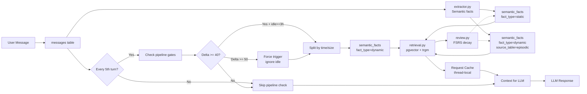
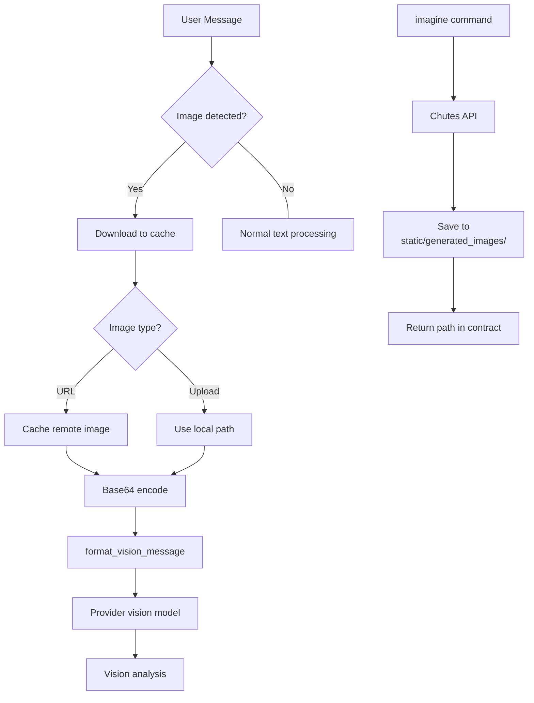
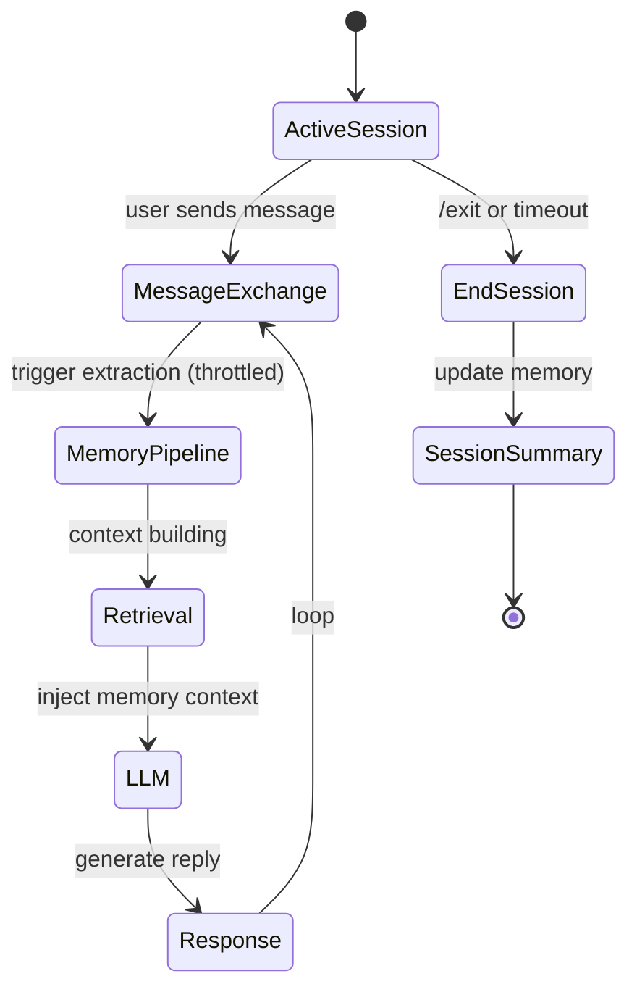
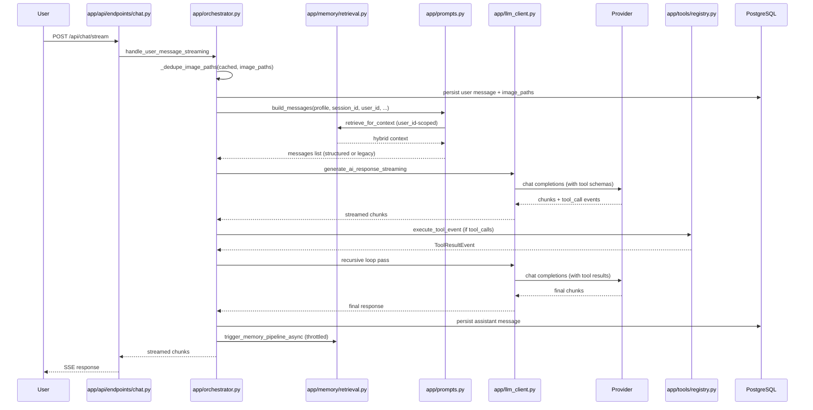

# Yuzu Companion — Application Module

The `app/` directory is the core of Yuzu Companion — the AI companion system that powers long-running conversations with persistent memory, multimodal input, and multi-provider dispatch.


---

## Table of Contents

- [Overview](#overview)
- [Directory Structure](#directory-structure)
- [Core Entry Points](#core-entry-points)
  - [`file app/orchestrator.py`](#apporchestratorpy--message-orchestration)
  - [`file main.py`](#mainpy--fastapi-web-server)
  - [`file cli/app.py`](#cliapppy--cli-application)
- [API Routing](#api-routing)
- [Database Layer](#database-layer)
- [AI Provider System](#ai-provider-system)
- [Tool System](#tool-system)
- [Memory System](#memory-system)
- [Multimodal System](#multimodal-system)
- [Encryption](#encryption)
- [Session Management](#session-management)
- [Configuration](#configuration)
- [Workflow: Message Processing](#workflow-message-processing)
- [Dependencies](#dependencies)
- [Architecture Principles](#architecture-principles)


---

## Overview

Yuzu Companion is a multi-interface AI companion with:

- **Multi-provider dispatch** — Chutes, OpenRouter, Anthropic, OpenAI, Ollama, Cerebras, DeepSeek, Google, Grok, Groq, plus custom OpenAI-/Anthropic-style endpoints
- **Native function calling** — `ToolEvent` / `ToolResultEvent` is the only production tool protocol; legacy XML-style markup is stripped as cleanup text
- **Structured system content** — providers advertising `supports_structured_system_content=True` receive a content-array system message; others fall back to legacy single-string
- **Tenant-isolated PostgreSQL** — UUIDv7 primary keys, `user_id` FK on every tenant-scoped table, pgvector + pg_trgm extensions
- **Hybrid memory** — semantic facts, episodic memories, and conversation segments unified in a single `semantic_facts` table; FSRS-inspired retention
- **BYOK architecture** — API keys live only in browser `localStorage`; the `api_keys` table has been purged
- **Three interfaces** — Terminal (`cli/app.py` via Rich + prompt_toolkit), Web (`main.py` FastAPI), and programmatic API



---

## Directory Structure

```
app/
├── api/
│   ├── endpoints/              # FastAPI routers (auth, chat, memory, profile, sessions, stream, presets_endpoint)
│   ├── __init__.py             # Exposes api_router
│   ├── main.py                 # api_router composition
│   ├── static.py               # Static file mounting
│   └── utils.py
├── auth/                       # Cookie session + OAuth helpers
├── core/                       # LLMContext, presets, request keyring
├── db/                         # psycopg v3 connection + Database facade + queries.py (SSOT SQL)
├── memory/                     # Embedder, retrieval, extraction, pipeline, FSRS review
├── providers/                  # One file per provider; ProviderCapabilities declarations
├── services/                   # SessionService, MemoryService, ChatService, ConfigService
├── static/                     # Subdir for additional static assets bundled with the package
├── tools/                      # Native FC registry, schemas, multimodal helpers, per-tool modules
├── encryption.py               # ChaCha20-Poly1305 encryptor
├── key_manager.py              # Master key lifecycle
├── legacy_markup.py            # Strip-only cleanup helpers (not a live protocol)
├── llm_client.py               # Payload construction + provider dispatch
├── logging_config.py           # get_logger() factory
├── orchestrator.py             # Single entry point for user messages
├── profile_analysis.py         # Cross-session profile analysis
├── prompt.md                   # Canonical system prompt text
├── prompts.py                  # build_messages(), structured system content composer
├── stream_manager.py           # StreamBuffer (RAM buffering + single-write persistence)
└── visual_context.py
```

---

## Core Entry Points

### `file app/orchestrator.py` — Message Orchestration

The single entry point for handling user messages. Coordinates:

1. Image caching from user messages and explicit `image_paths`
2. Image deduplication by `os.path.realpath` (preserves first-occurrence order)
3. Vision model routing when images are detected
4. Native `tool_calls` execution via `app/tools/registry.py` (`ToolEvent` / `ToolResultEvent`)
5. Synthesis orchestration loop (max 4 iterations) with structured-system-content support
6. Response generation via provider selection
7. Memory pipeline triggering via `MemoryService.run_per_message_checks_async`
8. Auto session rename and post-turn cleanup

Streaming execution runs in a background worker thread with cooperative cancellation via `abort_check` and the `StreamFence` mechanism (UUID fence ID, 300s timeout).

### `file main.py` — FastAPI Web Server

The ASGI entry point registered as the `yuzu-server` console script:

- Lifespan management for the async psycopg connection pool and `init_pg_tables_async`
- Static mounts (`/static`, `/uploads`, `/generated_images`)
- HTML page routes (`/`, `/chat`, `/config`, `/about`, `/login`)
- Registers `api_router` from `app/api/`
- Loads `.env` via `python-dotenv`

### `file cli/app.py` — CLI Application

Terminal interface using Rich + prompt_toolkit. Registered as the `yuzu` console script:

- Interactive chat loop with command handling (`/model`, `/imagine`, `/vision`, `/session`, etc.)
- Session management menu
- Provider/model switching
- Code block extraction and saving
- Web interface launcher

### `file app/stream_manager.py` — Streaming State Coordinator

`StreamBuffer` owns in-flight stream buffers outside the request thread. It accumulates chunks in RAM, replays buffered output to reconnecting clients, persists once on completion, and self-cleans after the DB write. The API layer reads from it during reconnect and profile reload paths, while the orchestrator worker thread writes into it as generation advances.

---

## API Routing

### `file app/api/__init__.py`

Package init that exposes `api_router` for registration in `main.py`.

### `file app/api/main.py`

Composes the routers exported by each `app/api/endpoints/*` module into a single `api_router`.

### Routers in `app/api/endpoints/`

| Module | Prefix | Purpose |
| --- | --- | --- |
| `auth.py` | `/api/auth` | Login, logout, session cookie |
| `chat.py` | `/api/chat` | Synchronous + streaming message handling |
| `memory.py` | `/api/memory` | Memory stats, decay, rebuild |
| `presets_endpoint.py` | `/api/presets` | Preset CRUD + active switching |
| `profile.py` | `/api/profile` | Profile read + update (settings, providers, advanced params) |
| `sessions.py` | `/api/sessions` | Session CRUD + auto-rename |
| `stream.py` | `/api/stream` | Stream state recovery for reconnecting clients |

`/api/config` (served by `ConfigService.get_frontend_config`) is the frontend SSOT for provider/vision model lists — eliminates hardcoded model lists in `static/js/config.js`.

The streaming endpoints (`/api/chat/stream`, `/api/profile`) support state reattachment: when a background stream is still active, they surface the live `StreamBuffer` content so the UI can recover after a disconnect or reload without losing the partial assistant response.

---

## Database Layer

### `file app/db/queries.py` — Schema DDL + SQL SSOT

Single source of truth for SQL strings, schema DDL, encryption helpers, and row parsers. All queries in business logic go through constants exported from this file.

**Tenant model:**

- `profiles` — UUIDv7 PK; tenant root
- `chat_sessions` — UUIDv7 PK; `user_id` FK → `profiles(id)` ON DELETE CASCADE
- `messages` — SERIAL int PK; `session_id` + `user_id` UUID FKs
- `semantic_facts` — SERIAL int PK; `user_id` UUID FK; `vector(4096)` embedding (Qwen3-Embedding-8B)
- `user_identities` — OAuth provider linkage (Google sub / GitHub id)
- `user_sessions` — session token storage

**Extensions:** `pgcrypto`, `vector` (pgvector), `pg_trgm`.

**Safety rules:**

- NEVER drops tables
- Only safe migrations (add columns, never destructive)
- Aborts if database corruption detected
- Legacy migration columns (`legacy_int_id`, `legacy_session_id`, `memory_json`) are NOT in `SCHEMA_DDL` — they exist only as migration artifacts

### `file app/db/` — Connection + Database Facade

- `connection.py` — `get_sync_pool()`, `get_async_pool()`, `close_async_pool()`, `PgSession` / `AsyncPgSession` context managers
- `__init__.py` — `Database` facade exposing the high-level operations used by orchestrator and services
- `init_pg_tables_async()` — invoked at FastAPI startup; idempotent DDL apply

---

## AI Provider System

### `file app/providers/` — Pluggable Provider Architecture



**Capability matrix (current declarations):**

| Provider | Structured System Content | Native FC | Streaming FC | Tool-Call Parsing |
| --- | --- | --- | --- | --- |
| Chutes | ✅ | ✅ | ✅ | ✅ |
| OpenRouter | ✅ | ✅ | ✅ | ✅ |
| Anthropic | ❌ | ✅ | ✅ | ✅ |
| OpenAI | (default) | ✅ | ✅ | ✅ |
| Ollama / Cerebras / DeepSeek / Google / Grok / Groq / custom | (default false) | per provider | per provider | per provider |

`ProviderCapabilities` defaults to `False` for every flag — providers opt in by passing kwargs to the `super().__init__()` call.

---

## Tool System

The tool system is driven by native function calling and `ToolEvent` / `ToolResultEvent`. Legacy XML-style markup is cleanup text only and must not be treated as a live protocol.

### `file app/tools/schemas.py` — Tool Schema Definitions

```python
@dataclass
class ToolParam:
    name: str
    description: str
    type: str = "string"
    required: bool = True
    default: Optional[str] = None

@dataclass
class ToolDefinition:
    name: str
    description: str
    parameters: List[ToolParam]
    requires_session: bool = False
    category: str = "general"
```

Plus `StreamToolEvent`, `make_tool_call_event()`, `new_turn_id()`.

### `file app/tools/registry.py` — Central Registry

Single source of truth for tool dispatch. Lazy-loads `TOOL_DEFINITIONS` from each tool module on first access.

**Key exports:**

- `get_tool_definitions()` — returns list of all registered `ToolDefinition` dicts
- `get_tool_definition(name)` — returns schema for a specific tool
- `execute_tool_event(event, session_id, user_id)` — canonical async execution path producing a `ToolResultEvent`
- `get_tool_schemas()` — OpenAI-format tool schemas for the LLM payload
- `get_tool_role(name)` — maps tool name to DB role string

### Tool Dispatch Flow



**Dispatch priority:**

1. Structured `tool_calls[0]` from LLM → `execute_tool_event` → persist → synthesis if needed
2. Plain text → return as-is

### Registered Tool Schemas

| Tool | Role | Params | Terminal |
| --- | --- | --- | --- |
| `image_generate` | `image_tools` | `prompt` (str, required) | ✅ |
| `http_request` | `request_tools` | `url` (str, required), `method` (str, optional) | ❌ |
| `memory_search` | `memory_search_tools` | `query` (str, required) | ❌ |
| `memory_store` | `memory_store_tools` | `fact` (str, required), `category` (str, optional) | ❌ |

### Tool Modules

Each tool module exports a `TOOL_DEFINITION` dict alongside its `execute()` function:

| Module | Purpose |
| --- | --- |
| `app/tools/image_generate.py` | Image generation via Chutes API |
| `app/tools/http_request.py` | Fetch public HTTPS endpoints with size/type validation |
| `app/tools/memory_store.py` | Persist semantic facts with LLM-guided categorization |
| `app/tools/memory_search.py` | Hybrid retrieval across semantic + episodic memories |
| `app/tools/multimodal.py` | Vision model routing and image caching (non-tool helpers) |

---

## Memory System

The memory subsystem lives in `app/memory/` and provides long-term, structured memory with FSRS-inspired retention dynamics.

**Performance optimizations:**
- Request-scoped caching for memory state and embeddings (`_clear_embedding_cache()`)
- Throttled pipeline checks (every 5th turn, not every turn)
- Combined retrieval (single embedding for static + dynamic)
- Short query skip (< 4 chars → no embedding)



### Memory Layers

| Layer | `fact_type` | `metadata.source_table` | Purpose |
| --- | --- | --- | --- |
| **Semantic** | `static` | — | Stable facts as (entity, relation, target) triples |
| **Episodic** | `dynamic` | `episodic_memories` | Summarized interaction events with emotional weight |
| **Segments** | `dynamic` | `conversation_segments` | Chunked conversation windows for summarization |

### Pipeline Triggers

| Condition | Threshold | Behavior |
| --- | --- | --- |
| **Throttle** | Every 5th turn | Skip pipeline check 80% of turns |
| **Base trigger** | Delta >= 40 messages + idle >= 3 hours | Normal trigger |
| **Force trigger** | Delta >= 50 messages | Trigger regardless of idle |
| **Fence TTL** | 120 minutes | Stale job cleanup |

### Request Caching

Two thread-local caches reduce per-turn overhead:

| Cache | Location | What it Caches |
| --- | --- | --- |
| **Memory state** | `app/memory/memory.py` | `get_memory_state()` results |
| **Embedding** | `app/memory/retrieval.py` | Query embeddings for combined retrieval |

Both cleared at end of each turn via `_clear_embedding_cache()` (and the memory-state equivalent).

### Unified `semantic_facts` Table

All memory types stored in a single PostgreSQL table with pgvector:

```sql
CREATE TABLE semantic_facts (
    id SERIAL PRIMARY KEY,
    session_id UUID,
    user_id UUID NOT NULL REFERENCES profiles(id) ON DELETE CASCADE,
    fact_type VARCHAR(20),  -- 'static' | 'dynamic'
    content TEXT,
    embedding VECTOR(4096),   -- Qwen3-Embedding-8B
    metadata JSONB,           -- confidence, importance, source_table, etc.
    valid_at TIMESTAMP,       -- When fact became true
    created_at TIMESTAMP,
    last_accessed TIMESTAMP,
    invalid_at TIMESTAMP      -- Soft delete (NULL = active)
);
```

### FSRS-Inspired Retention

- Memory **stability** increases with access count
- **Importance** decays: `importance × exp(-hours/stability)`
- Frequently retrieved memories become **long-term anchors**
- Low-importance memories **naturally fade**

### Key Modules

| Module | Purpose | Key Exports |
| --- | --- | --- |
| `db_memory.py` | Unified CRUD over `semantic_facts` with pgvector search | `save_fact()`, `search_similar()`, `invalidate_fact()` |
| `retrieval.py` | Hybrid scoring retrieval pipeline | `retrieve_memories_combined()`, `_clear_embedding_cache()` |
| `extractor.py` | LLM-based semantic + episodic extraction | `upsert_semantic_memory()` |
| `memory.py` | Background pipeline + batch segmentation | `trigger_memory_pipeline_async()` |
| `review.py` | FSRS-style decay and reinforcement | `run_decay()`, `reinforce_memory()` |
| `embedder.py` | Chutes API embedding client | `embed_text()`, `EMBEDDING_DIM=4096` |

---

## Multimodal System

### `file app/tools/multimodal.py`

Handles image processing for vision and generation:



**Vision pipeline:**

1. Extract image URLs/paths from message markdown
2. Download remote images to `static/image_cache/` (URL hash as filename)
3. Encode as base64 `data:` URI
4. `format_vision_message()` builds a content array with a `seen` set so the
   same source never produces duplicate `image_url` blocks
5. Provider executes the vision-capable model
6. Vision response attached to conversation

**Image generation pipeline:**

1. Detect `/imagine` command or image generation keywords
2. Call Chutes image API
3. Save result to `static/generated_images/`
4. Return markdown with image path
5. Synthesis pass (via orchestrator) for the model to describe / react to the generated image

**Defense-in-depth image dedup** also lives in `app/orchestrator.py`
(`_dedupe_image_paths` by `os.path.realpath`) and `app/prompts.py`
(`_build_multimodal_message` with a `seen` set).

---

## Encryption

### `file app/encryption.py`

ChaCha20-Poly1305 encryption for API keys at rest:

- **API keys**: Always encrypted
- **Messages**: Encryption disabled by default (configurable)
- Key derivation from master key in `encryption.key`
- Fallback to sentinel on decryption failure

### `file app/key_manager.py`

Master key lifecycle management:

- Key generation on first run
- Secure key storage
- Key rotation support

---

## Session Management



Session lifecycle is coordinated by `app/services/session_service.py`:

- `start_session_async()` — initialize session, run memory pipeline
- `end_session_cleanup_async()` — flush state, run finalization
- `auto_name_session_if_needed_async()` — LLM-driven session rename
- `init_new_session_async()` — create a fresh session for the user

On session start:

1. Run FSRS decay on existing memories
2. Segment unsegmented messages
3. Extract semantic + episodic memories
4. Initialize session context

---

## Configuration

### Profile Settings (stored in `profiles` table)

```python
{
    "user_name": str,             # User's display name
    "partner_name": str,          # AI companion name
    "affection": int,             # 0-100 affection level
    "theme": str,                 # UI theme
    "memory": {                   # Player profile memory
        "player_summary": str,
        "key_facts": {
            "likes": [],
            "dislikes": [],
            "personality_traits": []
        }
    },
    "providers_config": {
        "preferred_provider": str,
        "preferred_model": str,
        "vision_model_preferences": {"provider": str, "model": str},
        "streaming_enabled": bool
    },
    "context": {
        # Loose top-level context (legacy)
        "temperature": float,
        "top_p": float,
        "top_k": int,
        "max_tokens": int,
        "additional_instructions": str,
        "history_limit": int,
        # Preset storage (current SSOT for runtime params)
        "presets": [
            {"name": str, "payload": {...}, "is_active": bool},
            ...
        ],
        "active_preset": str
    }
}
```

### Preset Round-Trip (Phase 2 contract)

- `context.presets` is the source of truth.
- Schema: `[{name, payload, is_active}, ...]` with at most one `is_active=True`.
- Active resolution: the most recently set `is_active` entry wins (deterministic).
- `sync_top_level_with_active()` mirrors the active preset's payload into the
  legacy top-level context keys so older readers that look at
  `context["temperature"]` still see the active values during the transition
  window.
- `LLMContext.from_profile` calls `resolve_active_preset_payload()` and uses
  that as the *only* source for runtime parameters when a preset is active.

### API Key Management (BYOK Architecture)

Yuzu Companion employs a strict Bring Your Own Key (BYOK) architecture.
The server does NOT act as a password manager. Credentials only live in
memory during the request lifecycle.

- **Frontend Storage:** API keys are stored securely in the browser's
  `localStorage` (`yuzu_byok_config`).
- **Transmission:** Keys are injected dynamically via the `X-Provider-Key`
  and `X-Provider-BaseUrl` HTTP headers.
- **Backend Role:** The backend resolves these headers into a transient
  `LLMContext` object via `app/core/context.py`'s request keyring, ensuring
  zero persistent secret storage in the database.
- **Legacy:** The `api_keys` table has been destructively removed to comply
  with this security model (see `migrations/step_3_1_purge_api_keys.sql`).

---

## Workflow: Message Processing



---

## Dependencies

```markdown
# Core
pycryptodome>=3.20.0    # ChaCha20-Poly1305 encryption
python-dotenv>=1.0.0    # .env loading
fsrs>=6.3.1             # Free Spaced Repetition Scheduler for memory decay

# Database
psycopg[binary,pool]>=3.1  # PostgreSQL adapter (psycopg v3) with pgvector support

# Web (FastAPI)
fastapi>=0.115.0        # Modern async web framework
uvicorn[standard]>=0.30.0  # ASGI server
pydantic>=2.8.0         # Data validation with type hints
python-multipart>=0.0.9 # For file uploads
Jinja2>=3.1.0           # Template engine

# Terminal UI
rich>=13.0.0            # Rich terminal formatting
prompt-toolkit>=3.0.0   # Interactive prompts
textual>=0.47.0         # TUI framework

# Networking
requests>=2.33.0        # HTTP client for AI providers
httpx>=0.27.0           # Async HTTP client
```

---

## Architecture Principles

1. **Single entry point** — `handle_user_message()` / `handle_user_message_streaming()`
   in `app/orchestrator.py` are the only gateways for user messages.
2. **Native FC only** — all tool execution flows through
   `app/tools/registry.py::execute_tool_event`. No XML-style markup as a
   live protocol.
3. **SSOT for SQL** — every query string and DDL statement lives in
   `app/db/queries.py`. Business logic never inlines SQL.
4. **Tenant isolation** — every `user_id`-scoped read/write filters by
   `user_id`; every retrieval function accepts and forwards it.
5. **Preset-driven runtime params** — `LLMContext.from_profile` resolves the
   active preset payload and uses that as the only source for `temperature`,
   `top_p`, `top_k`, `max_tokens`, `additional_instructions`.
6. **Structured system content** is capability-gated per provider; legacy
   text fallback exists for providers that don't declare
   `supports_structured_system_content=True`.
7. **Layered image dedup** — `_dedupe_image_paths` in orchestrator +
   `seen` set in `build_messages` + `seen` set in
   `format_vision_message`. The same file referenced via different path
   forms never produces duplicate `image_url` blocks.
8. **Safe migrations** — the database never drops tables, only adds
   columns; legacy migration columns are migration artifacts, not part of
   `SCHEMA_DDL`.
9. **No heuristic detection** — the LLM determines tool calls via native
   function calling. There are no hardcoded regex-driven execution paths.
10. **Request-scoped caching** — memory state and embeddings cached
    per-turn and cleared at turn end to minimize API calls.
11. **BYOK only** — API keys never persist server-side; the `api_keys`
    table is gone and must not be reintroduced.
12. **Stream ownership** lives in `app/stream_manager.py`. Do not add
    parallel streaming stacks.
