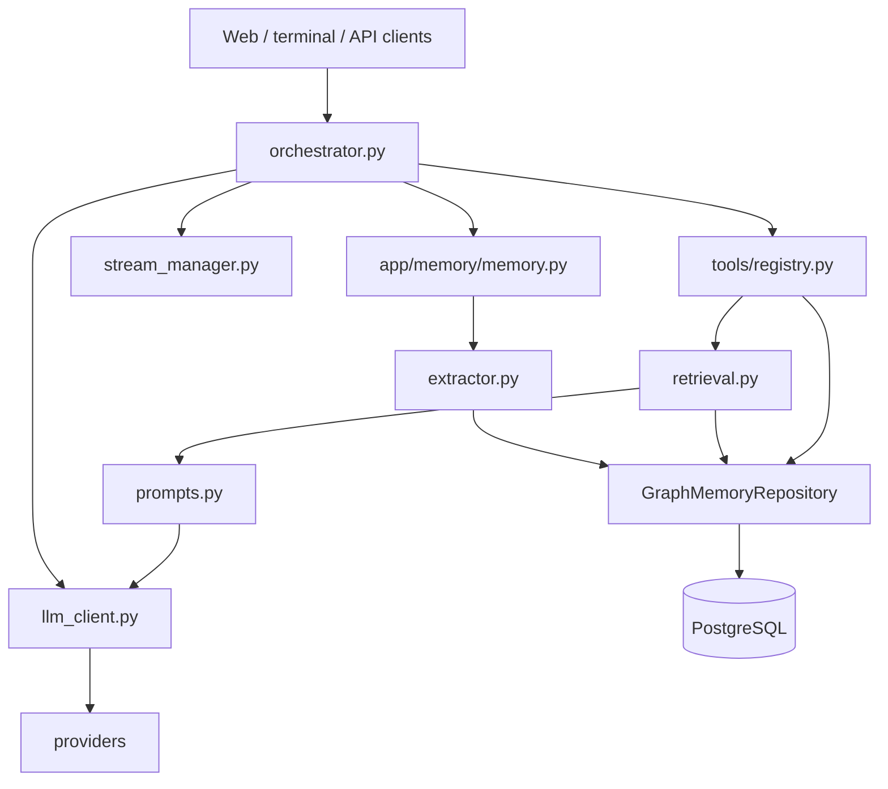
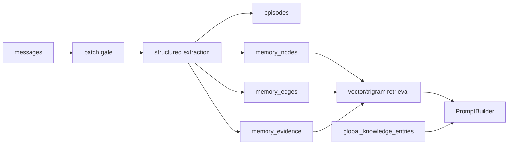

# Yuzu Companion — Structural Blueprint

> **Version:** current `dev` branch · **Runtime:** Python 3.12+ · **Database:** PostgreSQL + pgvector · **Web:** FastAPI + Jinja2

This blueprint describes the current implementation. The repository's source of truth for SQL and DDL is `app/db/queries.py`; the source of truth for graph memory behavior is `app/memory/`.

## 1. System topology



## 2. Runtime components

| Component | Location | Responsibility |
|---|---|---|
| Orchestrator | `app/services/orchestrator.py` | Coordinates message handling, tools, streaming, and post-turn work |
| LLM client | `app/services/llm_client.py` | Builds provider requests and dispatches streaming/non-streaming calls |
| Providers | `app/providers/` | Provider implementations and capability declarations |
| Tool registry | `app/tools/registry.py` | Native function-call dispatch and structured tool results |
| Memory pipeline | `app/memory/memory.py` | Batch gating, fencing, extraction persistence, and background worker |
| Extractor | `app/memory/extractor.py` | One structured extraction pass for eligible batches |
| Graph repository | `app/memory/graph.py` | Graph persistence, provenance writes, searches, and bounded expansion |
| Retrieval | `app/memory/retrieval.py` | Vector/trigram graph retrieval and prompt-shaped formatting |
| Embedder | `app/memory/embedder.py` | 1536-dimensional Chutes embeddings |
| Prompt builder | `app/services/prompt_service.py` | Presents retrieved memory and explicit knowledge to providers |
| Database layer | `app/db/queries.py`, `app/db/connection.py` | SQL/DDL source of truth and pooled psycopg access |
| Stream manager | `app/services/stream_manager.py` | Stream ownership, buffering, persistence, and cleanup |

## 3. Graph memory architecture



### Canonical stores

| Table | Role |
|---|---|
| `messages` | Raw source history |
| `episodes` | Batch summaries and source ranges |
| `memory_nodes` | Inferred claims/entities |
| `memory_edges` | Typed relationships |
| `memory_evidence` | Node/edge provenance |
| `global_knowledge_entries` | Explicit user-managed facts |

All are tenant-scoped where applicable. Graph embeddings use `vector(1536)` when present. Retrieval requires `user_id` and applies bounded expansion.

### Pipeline behavior

The memory worker uses message-ID cursors and a per-session fence. Eligible batches are extracted once, then persisted as graph records. Evidence links extracted nodes to source messages and episodes.

## 4. Tool and request flow

Native provider tool calls become structured `ToolEvent` objects, execute through the central registry, and return `ToolResultEvent` data. Memory tools use graph retrieval and graph node persistence. Backend tools do not emit UI Markdown or HTML.

## 5. Database model

The DDL is defined in `app/db/queries.py` and uses PostgreSQL extensions `pgcrypto`, `vector`, and `pg_trgm`.

Important invariants:

- all tenant-scoped reads/writes constrain `user_id`;
- graph confidence and importance are within `0..1`;
- edges are unique by tenant, endpoints, and type;
- edge endpoints cannot be self-loops;
- evidence targets a node or edge;
- validity is represented by `valid_from` / `valid_until` and node status;
- foreign keys preserve ownership and referential integrity;
- provider API keys are supplied through the browser BYOK flow and are not persisted server-side.

## 6. Memory retrieval

`app/memory/retrieval.py` uses an embedding when available and falls back to trigram text search. It retrieves active graph nodes, attaches evidence, expands one graph hop, and formats bounded context. Explicit knowledge is presented separately through `app/services/prompt_service.py`.

## 7. Memory maintenance

The standalone skill at `Skills/memory-guardian/` is intentionally separate from runtime extraction. Its helper:

```bash
python3 /home/workspace/Skills/memory-guardian/scripts/memory_review.py --format markdown
```

reports metrics and detects duplicate nodes/edges, near-duplicates, contradiction candidates, orphan nodes, missing provenance, dangling evidence, tenant/integrity violations, invalid validity windows, self-loops, embedding anomalies, and explicit-knowledge overlaps.

Only exact normalized duplicate nodes with confidence at least `0.98` may be merged through an explicit repair run. Repairs are tenant-scoped, preserve evidence/history, and avoid hard deletes. Ambiguous contradictions and near-duplicates remain report-only.

## 8. Documentation boundaries

- `docs/memory.md`: detailed graph memory behavior.
- `docs/database.md`: storage, tenant, and schema invariants.
- `docs/tools.md`: native tools and memory tool contracts.
- `app/memory/README.md`: runtime memory ownership and flow.
- `Skills/memory-guardian/`: operational graph maintenance, not runtime extraction.

Legacy semantic-memory implementations are outside the current architecture and must not be reintroduced into runtime SQL or maintenance workflows.
