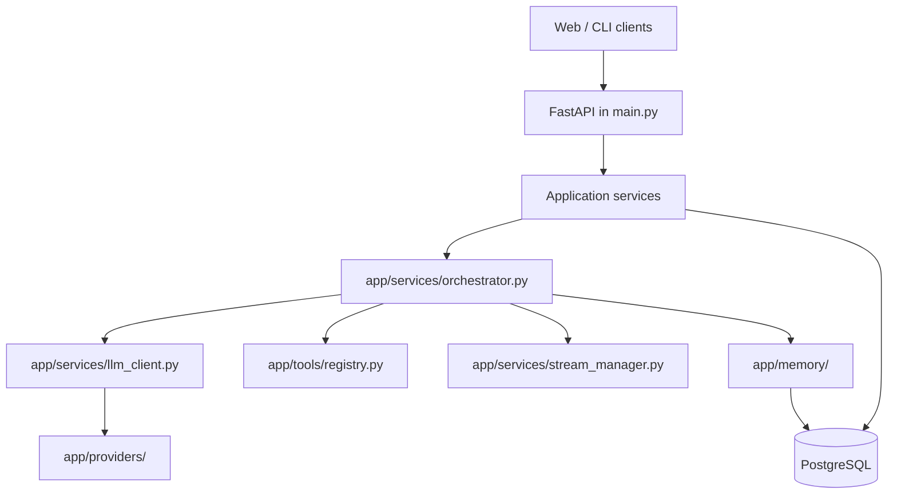

# System architecture

**Status:** Active reference. Code is authoritative.

## Runtime topology

## Ownership boundaries

| Area | Owner | Rule |
|---|---|---|
| ASGI app, lifespan, HTML pages, public static mount | `main.py` | Owns application startup/shutdown and page routes |
| HTTP router composition | `app/api/main.py` | Composes endpoint routers; `main.py` mounts it at `/api/v1` |
| Request/response handling | `app/api/` | HTTP concerns, authentication dependencies, validation, and serialization |
| Business workflows | `app/services/` | Coordinates providers, tools, memory, and persistence |
| Message orchestration | `app/services/orchestrator.py` | Canonical streaming and non-streaming message execution |
| External AI calls | `app/providers/` | Provider request construction, authentication, parsing, and capabilities |
| Shared infrastructure | `app/core/` | Configuration, BYOK context, encryption, logging, presets, multimodal helpers |
| Tool schemas and dispatch | `app/tools/` | Native function-calling definitions and structured results; no UI formatting |
| SQL and DDL | `app/db/queries.py` | SQL source of truth; no alternate inline schema |
| Graph memory | `app/memory/` | Extraction, graph persistence, retrieval, and provenance |
| Browser state and DOM | `static/js/modules/` | `ConversationStore` owns state; `DOMRenderer` owns chat DOM |

## Message flow

1. A web or CLI client sends a message to the FastAPI endpoint.
2. The endpoint authenticates the session, applies limits, and delegates to `ConversationService`.
3. `orchestrator.py` builds provider context, retrieves memory, and runs the native tool-call loop, bounded by `_MAX_ORCHESTRATION_LOOPS = 4`.
4. Tool calls pass through `app/tools/registry.py`; structured results are persisted and streamed.
5. `StreamManager` owns active SSE buffers in RAM and cleanup. The orchestrator persists the user, tool, and assistant records through the database facade.
6. Post-turn memory work runs asynchronously when configured credentials are available.

## Stable invariants

- Tenant-scoped database operations require `user_id`.
- Native provider function calling is the only execution protocol. Legacy markup is cleanup-only.
- Active model parameters resolve through the preset system when a preset is active.
- Provider keys are request-scoped BYOK data; they are not persisted as an `api_keys` table.
- Image paths are deduplicated at orchestration and prompt/vision construction boundaries.
- Frontend conversation updates flow through the store and renderer, not direct message-node insertion.

## Related references

- [`../backend/`](../backend/)
- [`../database/`](../database/)
- [`../memory/`](../memory/)
- [`../web/`](../web/)
- [`../../AGENTS.md`](../../AGENTS.md)
