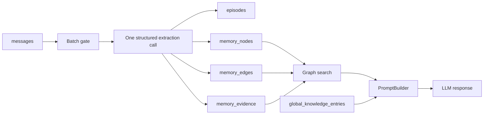

# Yuzu Companion Memory Architecture

This document describes the current graph-backed memory system. The canonical implementation is in `app/memory/`, `app/db/queries.py`, and `app/tools/memory_search.py` / `app/tools/memory_store.py`.

## Architecture overview



The memory pipeline is asynchronous and tenant-scoped. Raw conversation remains in `messages`; the pipeline summarizes eligible batches into `episodes`, extracts inferred claims into `memory_nodes`, creates typed relationships in `memory_edges`, and records provenance in `memory_evidence`. Explicit user-managed facts live separately in `global_knowledge_entries`.

The runtime has no legacy semantic-memory compatibility path, decay loop, or LLM review queue.

## Ownership

| Concept | Owner | Rule |
|---|---|---|
| Raw conversation | `messages` | Immutable source history for memory purposes |
| Summarized interaction | `episodes` | Carries session and source message range |
| Inferred claim/entity | `memory_nodes` | Confidence, importance, status, and temporal validity are explicit columns |
| Relationship | `memory_edges` | Typed and confidence-scored; endpoints are graph nodes |
| Provenance | `memory_evidence` | Links a node or edge to source episode/message records |
| Explicit user fact | `global_knowledge_entries` | User-managed and separate from inferred memory |
| Prompt presentation | `app/prompts.py` | Formats already retrieved context; does not own storage |

Every graph table carries `user_id` and all graph reads/writes must be tenant-scoped.

## Storage model

### `episodes`

Stores structured summaries of conversation batches.

- `id`, `user_id`, `session_id`
- `title`, `summary`
- optional `embedding vector(1536)`
- `importance`
- `source_start_message_id`, `source_end_message_id`
- `created_at`, optional `archived_at`

### `memory_nodes`

Stores inferred durable claims or entities.

- `id`, `user_id`, `node_type`, `content`
- optional `embedding vector(1536)`
- `confidence` and `importance`, each constrained to `0..1`
- `status`, normally `active` for current nodes
- `valid_from`, optional `valid_until`
- optional `supersedes_node_id` for temporal/history relationships
- `embedding_model`, `embedding_dimensions`
- `created_at`, `updated_at`, optional `last_accessed_at`

The runtime currently creates fact/category node types and uses normalized textual claims. A node is not proof of truth by itself; provenance and validity must be considered.

### `memory_edges`

Stores typed relationships between nodes.

- `id`, `user_id`
- `from_node_id`, `to_node_id`
- `edge_type`, `confidence`
- `valid_from`, optional `valid_until`
- `created_at`

The schema enforces tenant ownership, unique `(user_id, from_node_id, to_node_id, edge_type)`, and no self-loop endpoints.

### `memory_evidence`

Stores provenance without duplicating source text.

- `id`, `user_id`
- either `node_id` or `edge_id`
- optional `episode_id` and/or `message_id`
- `evidence_kind`, optional `excerpt_hash`
- `observed_at`, `created_at`

Evidence must never be fabricated or discarded merely because it is inconvenient. Missing or dangling references indicate an integrity problem.

### `global_knowledge_entries`

Stores explicit, user-managed facts with category, ordering, enabled state, and timestamps. It is not an inferred graph node table and must not be automatically overwritten by graph maintenance.

## Runtime pipeline

1. A session accumulates user/assistant messages.
2. The batch gate in `app/memory/memory.py` checks message delta, idle time, and an in-progress fence.
3. `app/memory/extractor.py` performs one structured extraction pass for an eligible batch.
4. `GraphMemoryRepository` persists episodes, nodes, edges, and evidence through tenant-scoped SQL.
5. `app/memory/retrieval.py` searches graph nodes using vector search when an embedding is available, with trigram text search as fallback.
6. Retrieved nodes receive bounded one-hop graph expansion and provenance.
7. `app/prompts.py` presents graph context and explicit knowledge to the provider.

The embedding client uses `EMBEDDING_DIM = 1536` and the graph stores `vector(1536)` embeddings when available.

## Retrieval

`retrieve_memories_combined_async()` requires `user_id`. It:

- skips empty queries;
- uses vector search when embedding succeeds;
- falls back to trigram text search when no embedding is available;
- returns bounded graph expansion;
- attaches node provenance;
- separates primary search results from bounded related-node expansion for prompt compatibility.

Retrieval is read-only with respect to memory quality. It does not run decay or mark a legacy review queue.

## Integrity expectations

- Every tenant-scoped query includes `user_id`.
- Active nodes and edges should have evidence coverage where the runtime can provide it.
- Evidence references must resolve within the same tenant.
- Validity windows must not end before they begin.
- Stored embedding dimensions must match the active graph dimension when an embedding is present.
- Contradictory claims may represent temporal change; content similarity alone cannot select a winner.
- Orphan nodes are review candidates, not automatic deletion candidates.

## Maintenance

The standalone Memory Guardian skill performs conservative graph inspection:

```bash
python3 /home/workspace/Skills/memory-guardian/scripts/memory_review.py --format markdown
```

It reports graph metrics, duplicate nodes and edges, near-duplicate candidates, contradiction candidates, orphan nodes, missing provenance, dangling evidence, tenant/integrity problems, embedding anomalies, and overlaps with explicit knowledge. It does not extract memories or call an LLM.

The only supported automatic repair is an explicit, high-confidence merge of exact normalized duplicate nodes within one tenant and node type. Repairs preserve evidence and history by redirecting safe edges, validity-expiring conflicting/self-loop edges, and marking duplicate nodes as merged. No hard deletes are performed.

## Maintenance boundary

Legacy semantic-memory tables, review queues, decay/reinforcement loops, and profile-level knowledge fields are outside the current architecture. They must not be reintroduced into runtime SQL or maintenance workflows.
