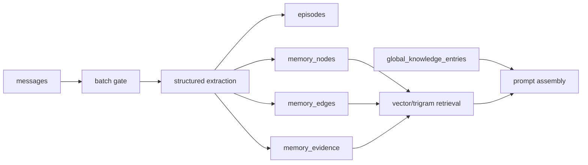

# Memory architecture

**Status:** Active reference. Runtime owners: `app/memory/`, `app/db/queries.py`, and `app/services/prompt_service.py`.

## Storage model

Raw conversation remains in `messages`. Eligible batches produce `episodes`, inferred `memory_nodes`, typed `memory_edges`, and `memory_evidence`. Explicit user-managed facts remain in `global_knowledge_entries`.

## Runtime flow

1. `app/memory/memory.py` checks message cursors, batch eligibility, idle state, and the per-session fence.
2. `app/memory/extractor.py` performs one structured extraction pass for an eligible batch.
3. `app/memory/graph.py` persists graph objects and provenance with tenant ownership.
4. `app/memory/retrieval.py` performs vector search when a query embedding is available and falls back to trigram text search.
5. Retrieval adds bounded graph expansion and provenance.
6. `app/services/prompt_service.py` presents graph context and explicit knowledge to the provider.

Embedding requests use `gemini/gemini-embedding-2-preview` with dimension `1536`, through the Yuzu Portal request-scoped keyring.

## Integrity rules

- Every graph query requires `user_id`.
- Evidence must resolve within the same tenant.
- Validity intervals must be coherent.
- Embedding dimensions must match `1536`.
- Similarity alone does not prove that two claims are duplicates or contradictions.
- Orphan and contradiction candidates require review; they are not automatic deletion targets.

## Maintenance boundary

The runtime does not use a legacy semantic-facts table, decay loop, or LLM review queue. The Memory Guardian skill inspects graph quality separately. Its default report is read-only; any repair must preserve evidence/history and avoid hard deletes.

## Related implementation docs

- `app/memory/README.md` — package-level runtime ownership
- [`../database/`](../database/) — schema and persistence invariants
- `Skills/memory-guardian/` — operational graph maintenance, when installed in the workspace
