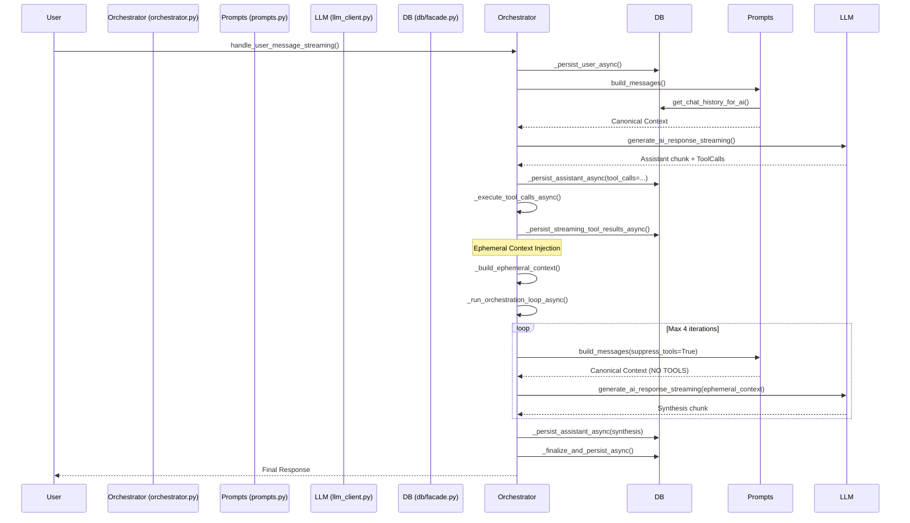

# Architecture Audit: Conversation Orchestration & Synthesis Pipeline

## 1. Executive Summary

The current orchestration pipeline is a hybrid. It successfully handles tool execution via native function calling but does so using a **split architecture**. Instead of a single recursive orchestration loop where tool results are persisted and the loop immediately re-enters history generation for the next LLM call, the architecture separates the "first pass" from "synthesis passes." 

Crucially, **synthesis is NOT just another iteration of the normal loop.** While it limits iterations to `_MAX_ORCHESTRATION_LOOPS = 4` (showing intent to support iterative reasoning), synthesis uses a parallel orchestration path (`_run_orchestration_loop_async` and `_stream_synthesis_async`) that injects "ephemeral context" (unpersisted tool calls and results) rather than relying exclusively on the canonical DB history.

**Primary Question Answer:**
Synthesis is a separate pipeline. It is not simply another iteration of the normal orchestration loop. It uses `suppress_tools=True`, bypasses tool execution, and injects state via `ephemeral_context` rather than solely relying on the canonical history rebuilt by `build_messages()`.

## 2. Primary Question: Is synthesis a separate pipeline?

**Yes, synthesis is a separate pipeline.**

Evidence (`app/orchestrator.py`):
1. **Divergent Entry Points:** `handle_user_message_streaming` calls `generate_ai_response_streaming` for the initial pass. After tools are executed, it enters `_run_orchestration_loop_async` which delegates to `_stream_synthesis_async`—a separate generation wrapper that forces `is_tool_loop=True, suppress_tools=True`.
2. **State Injection:** Synthesis relies on `ephemeral_context` (assembled by `_build_ephemeral_context`), injecting the just-executed tool calls and results into the prompt rather than waiting for them to be picked up organically by a fresh `build_messages` call from the database history.
3. **Hardcoded Limitation:** Because synthesis uses `suppress_tools=True`, the LLM is explicitly prevented from calling further tools during synthesis loops. True infinite recursive reasoning (User -> LLM -> Tool A -> LLM -> Tool B -> Final) is architecturally impossible in this pipeline because tools are stripped out during the loop iterations.

## 3. Sequence Diagram



## 4. Call Graph

```text
handle_user_message_streaming()  [Orchestration Entry]
  ├── Database.add_message() (user)
  ├── generate_ai_response_streaming()
  │     └── build_messages()
  ├── [If Tool Calls]
  │     ├── _persist_assistant_async(tool_calls)
  │     ├── _execute_tool_calls_async()
  │     ├── _persist_streaming_tool_results_async()
  │     ├── _build_ephemeral_context()   <-- DIVERGENCE START
  │     └── _run_orchestration_loop_async()
  │           └── _stream_synthesis_async(suppress_tools=True, ephemeral_context)
  │                 └── generate_ai_response_streaming()
  │                       └── build_messages(suppress_tools=True)
  └── _finalize_and_persist_async()
```

## 5. Orchestration Graph

- **Primary Loop:** `handle_user_message_streaming()` / `handle_user_message()`
  - Owns: Initial context building, initial inference, tool invocation.
- **Synthesis Loop:** `_run_orchestration_loop_async()` 
  - Owns: Iterating over tool results (max 4).
  - Couplings: Forces `suppress_tools=True`. Depends on `ephemeral_context` being passed down from the Primary Loop.

## 6. Message Builder Inventory

- **`app/prompts.py: build_messages()`** (Canonical Builder)
  - **Owner:** `prompts.py`
  - **Callers:** `generate_ai_response`, `generate_ai_response_streaming`
  - **Purpose:** Constructs the canonical message list (System + DB History).
  - **Issue:** Used by both initial and synthesis passes, but modified via `suppress_tools=True` flag during synthesis.
- **`app/orchestrator.py: _build_ephemeral_context()`** (Temporary Builder)
  - **Owner:** `orchestrator.py`
  - **Callers:** `handle_user_message_streaming`
  - **Purpose:** Injects tool_calls and tool results into memory *before* DB persistence fully replicates to history queries.
  - **Issue:** Duplicates state already written to the DB. Creates a shadow history.

## 7. Payload Transformation Inventory

1. **DB -> Native Dictionary:** `get_chat_history_for_ai` returns structured dictionaries.
2. **Base64 injection:** `build_messages` mutating `image_paths` into `image_url` nodes.
3. **Structured System Payload:** `_compose_structured_system_message` transforms persona, memory, etc. into a content array if provider supports it.
4. **Ephemeral Context Injection:** `llm_client.py: generate_ai_response_streaming` explicitly appends `ephemeral_context` to the end of `messages` generated by `build_messages`.

## 8. History Ownership Matrix

| Operation | Component | Source of Truth |
| :--- | :--- | :--- |
| Initial AI Call | `prompts.py:build_messages` | DB History (`get_chat_history_for_ai`) |
| Tool Invocation | `orchestrator.py` | Local execution state |
| Synthesis AI Call | `llm_client.py:generate_ai_response` | DB History + `ephemeral_context` (Shadow State) |

## 9. Persistence Ownership Matrix

- **`_persist_user_async`**: Writes initial user message.
- **`_persist_assistant_async`**: Writes assistant replies. If a tool was called, writes `tool_calls` JSON into the message row.
- **`_persist_tool_result_async`**: Writes the tool result with `role='tool'` and `tool_call_id`.
- **Divergence:** State is persisted *immediately* before synthesis, yet synthesis relies on in-memory `ephemeral_context` rather than simply re-reading the DB. 

## 10. Provider Boundary Matrix

- **`app/providers/base.py` (`AIProviderManager`)**: Handles provider dispatch.
- **`app/llm_client.py`**: Clean adapter logic.
- **Orchestration coupling**: Very low. `orchestrator.py` and `prompts.py` only check boolean capabilities (`provider_supports_fc`, `provider_supports_structured_system`) via `AIProviderManager`. The orchestration layer itself does not contain OpenAI or Anthropic specific shaping logic beyond standard schema definitions.

## 11. Evidence of Duplicate Orchestration Paths

**Found.**
The existence of `_run_synthesis_async` and `_run_orchestration_loop_async` explicitly separates the "post-tool" generation from the initial generation.
*Source: `app/orchestrator.py:1060-1076`* - `handle_user_message_streaming` explicitly delegates to `_run_orchestration_loop_async` instead of looping internally.

## 12. Evidence of Duplicate Payload Construction

**Found.**
`ephemeral_context` is built via `_build_ephemeral_context()` explicitly to bridge the gap between tool execution and the synthesis pass.
*Source: `app/orchestrator.py:243`*

## 13. Evidence of Duplicate History Reconstruction

**Found.**
During the synthesis pass, `build_messages` rebuilds the canonical history, and *then* `ephemeral_context` is appended to it in `llm_client.py`. Because the tool execution was *already* persisted to the database prior to the synthesis loop, the DB query risks fetching it, meaning the ephemeral context could duplicate it if not carefully guarded (though currently, it appears DB replication/commit delays might be the reason for this pattern).

## 14. Architectural Smells

1. **The `suppress_tools` parameter:** Passed down from orchestrator to prompt builder to LLM client. Its existence proves that synthesis is not a normal conversation turn, but a special "tool-disabled" mode.
2. **Ephemeral Context:** The orchestration layer manually stitches JSON tool definitions (`_build_ephemeral_context`) despite those exact structures being handled cleanly by persistence.
3. **Dead-end Synthesis:** The synthesis loop iterates up to 4 times (`_MAX_ORCHESTRATION_LOOPS = 4`) but explicitly disables tools (`suppress_tools=True`). This means loop 2, 3, and 4 are virtually useless because the LLM can't call tools to trigger another loop iteration.

## 15. Risk Assessment

- **Iterative Reasoning Blocked:** An agent cannot execute Tool A, realize it needs more info, and execute Tool B. The architecture forces a "Text -> Tools -> Summary" cycle.
- **Race Conditions / Shadow History:** Relying on `ephemeral_context` rather than the DB for synthesis means if the DB persistence fails, the LLM still generates a response based on ghosts, resulting in desynchronized conversation history.

## 16. Recommended Target Architecture (Conceptual Only)

- **Single Orchestration While-Loop:** `handle_user_message` should contain a `while` loop.
- **No Ephemeral Context:**
  1. Build messages from DB.
  2. Call LLM.
  3. Stream response.
  4. If tools called -> Persist assistant message -> Execute Tools -> Persist Tool Results -> `continue` (loop again).
  5. If no tools called -> Persist assistant message -> `break` (end turn).
- **Remove `suppress_tools`:** The LLM should naturally decide to stop calling tools when the task is complete. No artificial "synthesis mode" is needed.